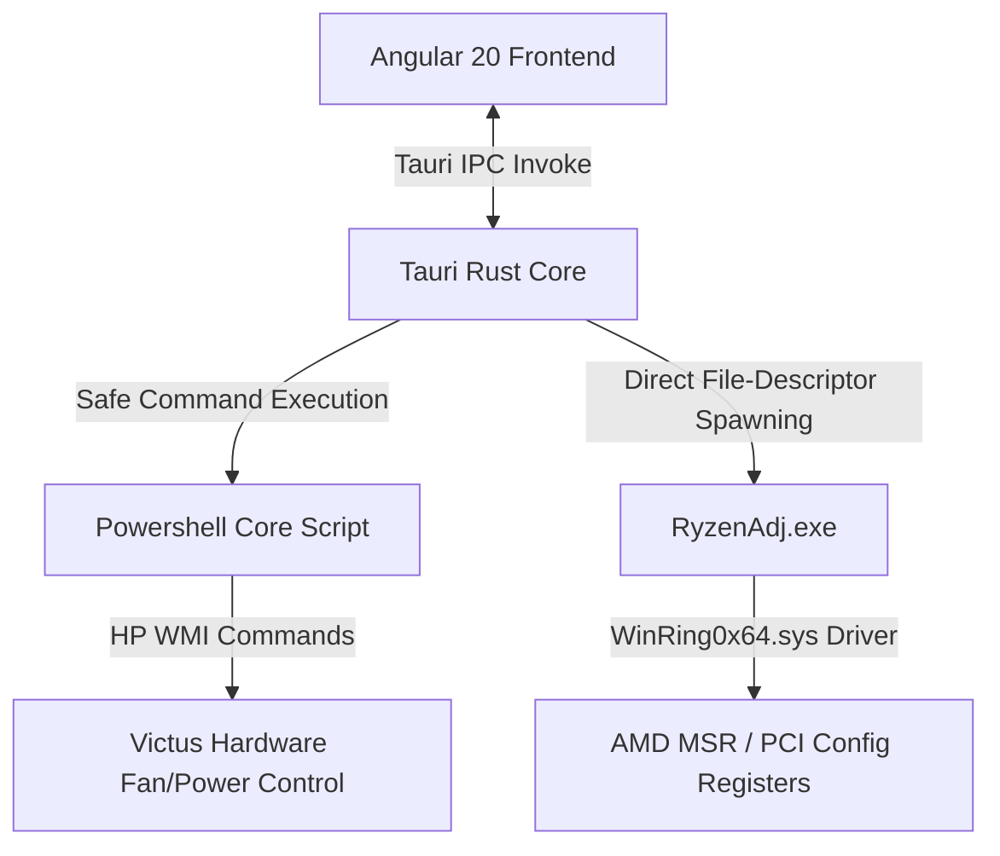

# NiyanTraK System Architecture Documentation

Welcome to the **NiyanTraK** architecture documentation. This document outlines the system components, data flows, and design decisions of the hardware control suite.

---

## 1. System Architecture Overview

NiyanTraK is a hybrid desktop application designed to control hardware settings (specifically fan speeds and power limits) on HP Victus series laptops. It is built using the following technologies:
- **Frontend**: Angular 20 (Standalone Component structure)
- **Desktop Runtime**: Tauri v2
- **Backend / System Interface**: Rust (with a safe execution layer interfacing with PowerShell scripts and low-level system binaries)



---

## 2. Key Subsystems & Mechanisms

### 2.1 Fan Control Mode
- **Powershell Script Path**: `C:\Program Files\fanControl\omen-hub-but-better\OmenHwCtl.ps1`
- **Execution Argument**: `-SetFanLevel`
- **Format**: `left_fan:right_fan` (e.g. `30:30` represents both fans set to level 30).
- **Manual Control Switch**: A toggle control enables manual override of the fan cycle.
  - **Manual Off**: Disables input sliders and sends `0:0` (System Auto / Fan Off) to reset native thermal curves.
  - **Manual On**: Enables custom range slider to apply exact duty cycle inputs between levels `19` and `39`.
- **Level & RPM Calibration**:
  - **Minimum Bounds**: Level `8` maps to `800 RPM` (leftmost position, zero-padded as `08:08` inside manual control command arguments).
  - **Maximum Bounds**: Level `39` maps to `5700 RPM` (maximum physical duty cycle).
  - **Range Calibrations**:
    - **Idle State (Level 8)**: Returns exactly `800 RPM` (formatted as `08:08`).
    - **Intermediate Step (Level 9)**: Returns `1200 RPM`.
    - **Lower Range (Levels 10 to 19)**: Starts at `1600 RPM` and increments linearly by `100 RPM` per step up to Level `19` (`2500 RPM`). Formula: `RPM = 1600 + (level - 10) * 100`.
    - **Transition Jump 1 (Level 19 to 20)**: Jumps from `2500 RPM` (level 19) to `3200 RPM` (level 20), representing a sudden `700 RPM` jump.
    - **Middle Range (Levels 20 to 29)**: Starts at `3200 RPM` and increments linearly by `100 RPM` per step up to Level `28` (`4000 RPM`). Level `29` maps to `4200 RPM`. Formula: `RPM = 3200 + (level - 20) * 100`.
    - **Transition Jump 2 (Level 29 to 30)**: Jumps from `4200 RPM` (level 29) to `4800 RPM` (level 30), representing a sudden `600 RPM` jump.
    - **Upper Range (Levels 30 to 39)**: Starts at `4800 RPM` and increments linearly by `100 RPM` per step up to Level `39` (`5700 RPM`). Formula: `RPM = 4800 + (level - 30) * 100`.
- **System Profile Mappings (Tauri Backend)**:
  - `silent` / `battery` => level `19:19` (`2500 RPM`)
  - `balanced` / `bed` / `medium` / `laptop` / `table` => level `30:30` (`4800 RPM`)
  - `high` / `turbo` / `performance` => level `34:34` (`5200 RPM`)
  - `max` / `extreme` => level `39:39` (`5700 RPM`)

### 2.2 System Profiles
Profiles are predefined system configurations designed for specific power and acoustic profiles:
- **battery**: 12W power limit, Silent fan speed (`19:19`).
- **laptop**: 25W power limit, Balanced fan speed (`30:30`).
- **table**: 35W power limit, Medium fan speed (`30:30`).
- **performance**: 45W power limit, High fan speed (`34:34` / turbo).
- **extreme**: 55W power limit, Max fan speed (`34:34` / turbo).

---

## 3. RyzenAdj CPU Control Subsystem

- **Execution Binary**: `src-tauri/resources/ryzenadj-win64/ryzenadj.exe` (with `./bin/ryzenadj.exe` and system PATH as fallbacks).
- **Execution Mode**: Non-blocking `async fn` commands executed on Tauri’s Tokio worker thread pool to prevent blocking the UI event loop.
- **Privileged Access Handling**: Since RyzenAdj modifies low-level hardware control tables, it requires elevated Administrator/root permissions. If lacking privileges, the backend command catches execution and permission failures (`os_access` errors) gracefully and passes structured error packets back to the frontend instead of causing a panic or application crash.
- **Real-Time Polling**: The frontend triggers a background scheduler to poll CPU diagnostics (`get_cpu_status`) every 2 seconds, parsing human-readable table outputs dynamically into active values (`STAPM Limit`, `Fast PPT Limit`, `Slow PPT Limit`, `Temp Throttle Limit`).
- **Telemetry Expansion**:
  - **Sustained & Burst Power (PPT)**: Merges Fast PPT and Slow PPT wattage telemetry. Displays real-time consumption values alongside target limits, and reads out active Slow Time constant values (Slow Time cooling constants).
  - **Sustained Power (STAPM)**: Renders live sustained power usage alongside configured BIOS limits and STAPM Time constant cooling boundaries.
  - **Sensors & Thermals**: Monitors and plots CPU Core Temperature (`THM VALUE CORE`), APU Skin Temperature (`STT VALUE APU`), and dGPU Skin Temperature (`STT VALUE dGPU`) with dynamic brand badging (`NVIDIA` or `RADEON`) and safe threshold boundaries, together with their safety throttle limits.
  - **Hardware Branding & Telemetry Integration**: CPU brand models and discrete GPU brands are fetched from low-level commands, cleaned up dynamically in the Tauri Rust backend, and exposed via IPC to the frontend.
  - **Peak Tracking**: Tracks actual real-time peak values of active wattage consumption and core temperatures dynamically inside Angular.
- **Dynamic Safety Temperature Targets**:
  - Enables user-customizable thermal throttling boundaries ranging from `50°C` to `95°C` setting via the `--tctl-temp` argument.
  - **Core Throttling Telemetry Robustness**: Recognizes both `thm limit core` and modern Hawk Point `Tctl Limit` bios table keys dynamically during parsing. Prevents slider override feedback loops by:
    1. Transitioning the UI dynamically to `'custom'` mode as soon as the user drags the linear sliders.
    2. Suspending hardware polling overwrites on `cpuTempLimit` while the user is actively customizing parameters (`cpuMode === 'custom'`).
    3. Discarding invalid parsed target temperatures below the minimum safety threshold (`50°C`).
- **Standard Presets**:
  - `Silent` $\rightarrow$ 15W TDP / 70°C throttle
  - `Bed Mode` $\rightarrow$ 35W TDP / 80°C throttle
  - `Performance` $\rightarrow$ 55W TDP / 90°C throttle
  - `Custom` $\rightarrow$ 8W to 55W customized slider and custom safety thermal limit slider

### 3.3 CPU Stress Test Subsystem
- **Execution Module**: `src-tauri/src/core/stress.rs`
- **Execution Mode**: Spawns multithreaded OS worker threads matching the system's logical core capacity (via `std::thread::available_parallelism()`).
- **Core Workload**: Executes synthetic math loops (`sqrt().sin().cos()`) utilizing both FPU and ALU execution pipelines to guarantee full, 100% CPU thread saturation.
- **Yielding Safety Design**: To prevent kernel scheduling blockages and interface freezes, each thread cooperatively invokes `thread::yield_now()`. This ensures the Tauri main thread and Windows window manager maintain high responsiveness while maximum thermal/wattage load is placed on the hardware registers.
- **Safety Termination**: If active, the stress test is automatically stopped upon the destruction or shutdown of the Tauri frontend application window, preventing background processor drain.

### 3.4 Persistent Custom Profile Presets
- **State Persistence**: Presets are loaded from and saved to a physical JSON file `custom_presets.json` in the workspace root instead of browser `localStorage`.
- **Tauri IPC Endpoints**: Invokes `load_custom_presets` and `save_custom_presets` Tauri commands for secure disk read/write access.
- **Preset Object Layout**:
  ```json
  [
    {
      "name": "custom_1716301234567",
      "powerLimit": 45,
      "fan": "manual",
      "fanLevel": 34,
      "fanLabel": "5200 RPM",
      "label": "Gaming Balanced",
      "isCustom": true,
      "tempLimit": 85
    }
  ]
  ```
- **In-Place Overwrites**: Entering an existing preset label updates its parameters in place rather than appending duplicate profiles.
- **Preset Deletion**: Custom presets can be deleted in-place with isolated click propagation, dynamically calling the Tauri save command to flush the updated presets list, and resetting active modes accordingly.

### 3.5 Dynamic Island Header Toast Center
- **Capsule Shell Layout**: Replaces standard bottom-fixed toasts with a premium, Apple-like "Dynamic Island" morphing capsule in the horizontal center of the Top Bar.
- **Idle State**: Displays the active performance profile (e.g. `⚡ PERFORMANCE` or `⚡ BED MODE`) with a subtle glowing border.
- **Morphing State**: Upon alert emission, spring-expands smoothly using CSS scale and size transitions, rendering success/error icons and alert messages. Reverts automatically back to the idle active profile capsule after 4.5 seconds.

---

## 4. Build System and Styling Configuration
- **Tailwind CSS version**: v4
- **PostCSS integration**: Configured through `postcss.config.json` (and `postcss.config.js`) in the project root utilizing the new `@tailwindcss/postcss` builder plugin package for v4.
- **Global Stylesheet**: `@import url(...)` for Google Fonts comes first, then `@import "tailwindcss"` — order is required by CSS spec.

## 5. UI Architecture — Standalone Component Decomposition

The user interface has been decomposed from a single monolithic file into a decoupled, modular hierarchy consisting of **10 standalone Angular components** nested under `src/app/components/`. 

The parent `AppComponent` remains the central state orchestrator, managing background polling loops, RyzenService integrations, and Tauri IPC command dispatches. Data is passed down to child elements via `@Input()`, and user interactions are piped back up to the orchestrator via `@Output() / EventEmitter` bindings.

### Component Architecture Map

*   **NavRailComponent (`app-nav-rail`)**: Left-anchored sidebar navigation rail docked underneath the horizontal Top Bar, hosting buttons for Quick Control and Stress Test pages.
*   **TopBarComponent (`app-top-bar`)**: Upper-anchored header spanning the entire width horizontally, displaying the custom brand logo in the top-left corner and the dynamic CPU state status pill on the right.
*   **StressBannerComponent (`app-stress-banner`)**: Floating overlay displaying progress bar and remaining duration capsule while stress workloads are running.
*   **MonitorStripComponent (`app-monitor-strip`)**: Real-time telemetry cards displaying unified power columns, peak values with aligned flex spacing, dynamic brand badges, and safety limits.
*   **ProfilesDrawerComponent (`app-profiles-drawer`)**: Permanent horizontal tray hosting preset performance configuration cards (Battery Saver, Bed Mode, Table Mode, Performance, Extreme, + Custom). Custom presets feature a dynamic `🗑️` button allowing in-place deletions with click isolation.
*   **BezelStripsComponent (`app-bezel-strips`)**: Floating bezel tab ribbon nested on the right edge of the screen, allowing users to trigger stress workloads on any view (narrowed to 58px bezel with Profiles ribbon trigger removed).
*   **FanControlComponent (`app-fan-control`)**: Cooling sub-system card hosting the manual fan speed override toggle, linear level slider, dynamic RPM readout, and Apply controls.
*   **CPUPowerPanelComponent (`app-cpu-power-panel`)**: Power limit card hosting active preset mode badge, exact watt custom TDP slider, and Apply controls.
*   **StressPanelComponent (`app-stress-panel`)**: FPU workload configuration view hosting segmented presets for duration and intensity, along with a 16-thread Core Burn simulator grid.
*   **FooterStripComponent (`app-footer-strip`)**: Bottom-anchored credit and version notice.

### Scoped Style Encapsulation & Host Layouts
1. **Style Isolation**: All CSS rules are encapsulated locally within each child component's `@Component.styles` attribute block using pure, vanilla CSS to maintain 100% design fidelity.
2. **Width Split (50/50 Layout)**: Custom elements `app-fan-control` and `app-cpu-power-panel` are styled with host flex rules (`flex: 1; display: flex; flex-direction: column;`) to preserve perfect visual column sizing.
3. **Margins & Bezel Peeking**: Layout paddings and absolute overlay coordinate maps leverage the standard `59px` right margin to maintain symmetrical alignment alongside the right edge bezel tabs.
4. **Curved Inner Frame Dock**: The main content wrapper `.main-frame-body` features a `border-top: 1px solid #222`, `border-left: 1px solid #222`, and `border-top-left-radius: 14px`. This creates a premium, smooth rounded border intersection where the top bar and left nav-rail meet, blending the outer `#0d0d0d` visual frame into the inner `#111111` active dashboard workspace.
5. **Unified Spacing Symmetry**: To prevent layout asymmetry under different operational modes, all outer margins (left, right, top bounds) and inner stacked row gaps are calibrated to exactly `16px`. This is achieved dynamically by:
   - Setting the scrollable `.viewport` top padding to `16px` (matching its `16px` left and bottom padding).
   - Calibrating the `.monitor-strip` bottom padding to `0px` so that it seamlessly yields to the viewport's top padding, creating a perfect `16px` gap between telemetries and page contents in both scrolled and unscrolled states.
   - Adjusting active `.profiles-drawer` margins to `16px 59px 0 16px` and active `.stress-banner` margins to `16px 59px 0 16px` (with inactive `border: none` to prevent layout outline leaks) to preserve the perfect spacing balance under all states.

### Visual Design Tokens (enforced)
| Token            | Value     | Usage                          |
|------------------|-----------|--------------------------------|
| Window bg        | `#0f0f0f` | `app-shell` background         |
| Topbar / Rail bg | `#0d0d0d` | `topbar`, `nav-rail`, `monitor-strip` |
| Content area bg  | `#111111` | `main-body`                    |
| Card bg          | `#171717` | `.card`, `.fan-card`           |
| Interactive bg   | `#1e1e1e` | Inputs, seg controls           |
| Separator border | `#222222` | All section dividers           |
| Card border      | `#242424` | Card outlines                  |
| Accent blue      | `#3b82f6` | Active states, toggles, sliders|
| Accent green     | `#22c55e` | Bar fill < 70% of limit        |
| Accent amber     | `#f59e0b` | Bar fill 70–90% of limit       |
| Accent red       | `#ef4444` | Bar fill > 90%, stress state   |

---

## 6. Visual Alignment & Standardized Preset Tuning (2026-05-22)

### 6.1 Spacing Alignment in Thermal Telemetry
- Swapped the visual order inside the CPU CORE sensor column of the `MonitorStripComponent` to display the current temperature first and peak temperature second (matching the package power column layout).
- Appended absolute `"Peak"` suffix to the readout element (e.g. `↑ 90°C Peak`).
- Increased `.monitor-peak` CSS layout boundary spacing `margin-left` to `12px` to guarantee a clean, visual gap from the core temperature metrics display.

### 6.2 Modernized Custom Presets Saving Trigger
- Replaced the low-fidelity emoji (`💾`) inside the `ProfilesDrawerComponent` Header with a vector SVG floppy-disk icon.
- Re-styled `.save-preset-btn` into a glowing glassmorphism button using:
  - Transparent theme color fills (`rgba(59, 130, 246, 0.1)`).
  - Responsive borders (`rgba(59, 130, 246, 0.25)`).
  - Subtle interactive click transition scaling down by `3%` (`transform: scale(0.97)`).

### 6.3 Standardized Built-in Presets to 90°C Target
- Standardized all 5 built-in profiles (Battery Saver, Bed Mode, Table Mode, Performance, Extreme) to default to a 90°C target temperature limit.
- Updated both `profiles` initial state declaration and custom presets dynamic loading logic inside `AppComponent` (`app.component.ts`).
- Upgraded the card specs display string inside `ProfilesDrawerComponent` to show target temperatures directly, matching: `{{ p.powerLimit }}W · {{ p.tempLimit }}°C · {{ p.fanLabel }}`.

### 6.4 Horizontal Slide Navigation & Layout Constraining
- Prevented detailed custom profile specifications from wrapping onto separate rows by increasing card width from `140px` to `160px`, and setting `.drawer-card-spec` to standard CSS ellipsis bounds (`white-space: nowrap; text-overflow: ellipsis; overflow: hidden;`).
- Wrapped cards inside a relative `.drawer-cards-wrapper` element equipped with floating absolute Left and Right circular scroll buttons (`scroll-btn`).
- Built micro-interactive mouse triggers that fade the circular slide buttons into view on hover, utilizing smooth, hardware-accelerated transitions and glow-accented borders.
- Bound slide actions directly to native `.scrollBy({ left: +/-240, behavior: 'smooth' })` API triggers.

### 6.5 Inline Custom Preset Saving Form & Alert Elimination (2026-05-22)
- **Prompt Alerts Bypassed**: Fully eliminated browser-based dialog prompts (`prompt()`) for custom profile naming.
- **Header Button Removal**: Removed the old `"Save Current"` button from the Profiles drawer header entirely to declutter the user interface.
- **Card Morphing Form**: Enabled the `+ Custom` drawer card to dynamically morph into a dedicated inline naming form when active (`currentProfile === 'custom'`).
- **Inline Styling & Event Handlers**:
  - Implemented `.custom-form` flex layout, `.custom-preset-input` text field, and `.custom-save-btn` interactive button nested inside the card.
  - Used `@angular/forms` `FormsModule` standalone integration to enable raw dynamic state synchronization.
  - Isolated click events inside the card utilizing propagation locks (`$event.stopPropagation()`) to prevent state interference.
  - Linked submit events to both Enter keypress and Save button clicks, dispatching custom names directly to parent orchestrator methods.
- **High Legibility Contrast Upgrade**: Improved legibility across all components (Profiles drawer, Monitor strip, Fan control, CPU power panel, Synthetic stress panel, and Ryzen diagnostics panel) by replacing low-contrast dark grey text colors (`#555`, `#444`, `#3a3a3a`) with highly readable `#888` grey text and highlighted active specs with soft glowing blue (`#a3cfff`).

### 6.6 Frosted Glass Theme & Telemetry Contrast Adjustments (2026-05-22)
- **`/limit` Telemetry Legibility**: Replaced the extremely dark `#444` font color for limit thresholds (e.g. `/ 90°C`, `/ 37.5°C`) inside `MonitorStripComponent` (`.limit-val`) with a clean, highly legible `#aaa` grey, and scaled its size to `12px` to make target metrics perfectly readable against dark backdrops without overpowering real-time values.
- **System-Wide Typography Scale-Up**: Banished all hard-to-read, ultra-small text labels (`9px` and `10px` sizes) across the dashboard, and scaled them up to highly comfortable readable bounds (`11px`, `11.5px`, and `12px` styles):
  - **Monitor Strip**: Scaled subtitles `.subrow-title` to `11px`, `.monitor-label` to `11.5px`, and limits grid items `.limit-grid-item` to `11px` with a crisp `#999` color.
  - **Profiles Drawer**: Scaled drawer title to `11.5px`, profile card specs `.drawer-card-spec` to `11px`, inline custom input text to `12px`, and card action buttons to `11.5px`.
  - **Fan Control**: Scaled slider edges `.slider-edge` and status description `.readout-sub` to `11.5px`.
  - **Stress Allocator**: Scaled synthetic grid core `.thread-id` labels to `11px` and threat intensity `.thread-pct` indicators to `11.5px`.
  - **Diagnostics Panel**: Scaled diagnostics card subtitles/limits text to `11px` and header descriptions/graph metadata to `12px` with brighter tones.
- **Unified Glassmorphic Dashboard**: Overhauled both core dashboard card controls—**CPU Power limits Panel** and **Fan Control Panel**—into matching state-of-the-art Frosted Glass components:
  - **Neutral Frosted Acrylic Fill**: Translucent neutral-dark backgrounds (`rgba(20, 20, 25, 0.65)`).
  - **Hardware Blur Refraction**: Saturation-boosted hardware backdrop filters (`backdrop-filter: blur(20px) saturate(130%)`).
  - **Specular Highlights**: Specular double-light highlights (outer white `1px solid rgba(255, 255, 255, 0.08)` border + inner top glowing edge inset `box-shadow`).
  - **Typography Enhancements**: Scaled up slider boundaries `.slider-edge` and readout subtext `.readout-sub` to `12.5px` with a highly readable `#bbb` / `#aaa` color scheme. Also scaled active TDP badges `.tdp-mode-badge` to `12.5px` and throttle subtext `.tdp-mode-sub` to `12px` to guarantee maximum clarity and contrast.
  - **Glass apply-btn**: Custom-morphed standard dark buttons into responsive glowing glass buttons with hover brightness shifts, border overlays, and scaling click animations (`transform: scale(0.98)`).

---

## 7. Desktop Widget & System Tray Integration (2026-05-22)

NiyanTraK now features an ultra-compact desktop companion widget and complete native operating system integration with the Windows system tray.

### 7.1 Compact Floating Telemetry Widget (`app-widget`)
- **Visual Design**: The desktop widget is an ultra-slim, frameless window with rich glassy transparency (`backdrop-filter: blur(20px)`), an subtle outer border, and precise row elements.
- **Draggable Drag Region**: A custom header strip (`32px` high) serves as a drag region (`data-tauri-drag-region`), allowing easy dragging and placement anywhere on the desktop.
- **Always-on-Top Toggle**: A premium toggle allows pinning the widget (`setAlwaysOnTop(true)`) to stay visible above all full-screen applications, or unpinning it to float normally.
- **Dynamic Size Adjuster**: 
  - To minimize the desktop footprint, users can toggle individual rows (Temperature Gauges, TDP Control, Fan control, Pinned Profiles) from the Settings screen.
  - Toggling these rows automatically calculates the exact new widget height and dynamically scales the window size using Tauri's `@tauri-apps/api/dpi` `LogicalSize` APIs.
  - This ensures that there is zero empty space and the window occupies only the pixels it needs.

### 7.2 System Tray Menu & Window Event Hooks
- **Tray Icon**: The app creates a native system tray icon utilizing Tauri's `TrayIconBuilder`.
- **System Tray Menu**: Right-clicking the tray icon presents a context menu:
  - **Show App**: Restores, unminimizes, and focuses the main NiyanTraK window.
  - **Toggle Widget**: Opens the desktop widget if closed, or shuts it down if active.
  - **Quit**: Exits the process.
- **Left-Click Action**: Single left-clicking the tray icon toggles the visibility of the main window (hiding it if visible, restoring it if hidden).
- **Minimize to Tray Event Hook**: 
  - Inside Rust, a custom hook listens for `tauri::WindowEvent::Resized` events.
  - If a resize event corresponds to the window being minimized (`is_minimized() == true`), and the **"Minimize to System Tray"** setting is active, the app intercepts the event and invokes `window.hide()` to keep the app running in the background.

### 7.3 Standalone Widget Launch Mode
- **CLI Startup Flag (`--widget`)**: The Tauri application supports launching only the companion widget without the main dashboard.
- **Execution Workflow**:
  - The Rust backend parses startup arguments. If `--widget` is detected, it skips showing the main `"main"` window and immediately constructs and displays *only* the `"widget"` frameless overlay.
  - Clicking the **"Show App"** tray option or double-clicking the tray icon at any point seamlessly loads the main dashboard layout.

---

## 8. Bug Fixes (2026-05-22)

### 8.1 Companion Widget Development Mode URL Resolution
- **Issue**: In development mode (where the local dev server operates dynamically on `http://localhost:1420/`), relative resolution using the static build target path `'index.html?window=widget'` failed to route correctly or load, preventing the companion widget from spawning or working properly under `npm run tauri dev`.
- **Resolution**: Implemented dynamic dev-mode detection using `window.location.port !== ''` inside both `SettingsPanelComponent` (`settings-panel.component.ts`) and `NavRailComponent` (`nav-rail.component.ts`). When a development environment is detected, the URL is correctly resolved to `?window=widget` (hitting `http://localhost:1420/?window=widget`), and defaults to `'index.html?window=widget'` under production environments.

### 8.2 Profiles Drawer Structural Isolation
- **Issue**: When navigating away from the dashboard ("Quick Control") to other sections like "Settings" or "Stress" via the left Nav Rail, the `<app-profiles-drawer>` element remained present in the main container, leaking borders, margins, and rendering cards in inappropriate views.
- **Resolution**: Wrapped the `<app-profiles-drawer>` declaration inside `app.component.ts` with Angular's structural directive `*ngIf="activePage === 'quick'"`. This ensures the profiles drawer is cleanly destroyed and removed from the DOM on other pages, avoiding layout leaks and keeping the viewport uncluttered.

### 8.3 Frameless Desktop Widget Polishing, Drag-Move, and Dynamic Panel Toggling (2026-05-22)
- **Widget Sizing**: Shrunk overall widget width from `230px` to `210px` for a much narrower, compact look.
- **Telemetry Rings Size**: Compacted the core and skin temp gauges to `32px` width and height, reducing the panel height to `48px`.
- **Selector Buttons Amplification**: Made the borderless 4-stage selectors for TDP and Fan auto-flex (`flex: 1`) with vertical padding `padding: 6px 0` and larger font sizes, allowing them to stretch to fill all available horizontal and vertical space for ease of clicking.
- **Tauri Drag Move Capability**: Added `"core:window:allow-start-dragging"` permission to `default.json` capability profile to authorize JS-based window drags. Implemented a robust manual window dragging system using `win.startDragging()` inside `widget.component.ts` on header `mousedown` to bypass Webview2 native capturing limitations on transparent frames.
- **Interactive Click Isolation**: Segregated the header dragging and button controls by using `(mousedown)="$event.stopPropagation()"` on `.header-controls`. This guarantees 100% responsive header window-dragging while keeping the control buttons perfectly aligned and clickable.
- **Pin (Always-On-Top) Visual Clarity**: Enhanced visual feedback for the Pin (`📌`) button. The unpinned button displays with `opacity: 0.5`, while the pinned/active state shifts to `opacity: 1` with a distinctive sleek blue background glow (`background: rgba(59, 130, 246, 0.15)`) and micro-border.
- **Dynamic Panel Removal (Minus Buttons)**: Implemented subtle, round minus (`-`) buttons on each widget panel. To keep the UI clutter-free, these buttons are hover-activated (hidden by default and fading into view on panel hover). Clicking a minus button hides the panel, updates `localStorage`, and triggers dynamic window resizing.
- **Real-Time Cross-Window Synchronization**: Added a Tauri event-listener for `'layout_changed'` inside the main app's `SettingsPanelComponent` (`settings-panel.component.ts`). If the user removes a panel directly from the widget overlay, the corresponding settings checkbox dynamically unchecks in real-time.
- **Scrollbar Bleed Prevention**: Injected a global stylesheet override (`::ng-deep html, ::ng-deep body { overflow: hidden !important; background: transparent !important; }`) to ensure absolutely no scrollbars are ever rendered in the widget.
- **Ellipsis chip wrapping**: Formatted `.profile-chip` with `flex: 1; text-overflow: ellipsis; overflow: hidden; white-space: nowrap; min-width: 0` for equal flex widths and ellipsis handling when names are long.
- **Universal preset pinning**: Enabled the pin button `📌` for standard presets as well, persisting their states in `localStorage` under `pinned_standard_presets`. The widget automatically fallbacks to showing Battery, Table, and Perf (labeled `"Perf"`) only when there are no custom or standard presets pinned.
- **TDP Selector Highlight Sync**: Stabilized the active TDP selector stage highlight by computing closest limits using `maxTdp` (`limits.fast_limit`) instead of real-time telemetry draw (`cpuTdp` / `limits.fast_value`), preventing the highlighted button from jumping when the CPU is idle.
- **Temp Rings Label Legibility**: Shrunk the font weight of `.ring-val` and `.ring-lbl` inside circular gauges to `400 !important` (Normal weight), ensuring the tiny telemetry text inside the circles is perfectly crisp, non-bold, and easy to read.
- **Dynamic Core Burn Allocator**: Overhauled the Core Burn Allocator grid inside `StressPanelComponent` (`stress-panel.component.ts`) to dynamically query and map exactly the local system's active logical threads utilizing `navigator.hardwareConcurrency` (e.g. rendering exactly 12 thread slots for Hexa-Core Hyperthreaded processors) instead of a hardcoded 16.
- **Centralized Presets Configuration File**: Isolated the default standard profiles from direct TS hardcoding and relocated them into a single centralized configuration file `presets.config.ts` (`src/app/presets.config.ts`). Imported this file synchronously across both the main orchestrator (`app.component.ts`) and the overlay widget (`widget.component.ts`), enabling easy pre-build adjustments in a single location.

### 8.4 Bezel Strip Widget Launcher Migration (2026-05-22)
- **Widget Trigger Relocation**: Migrated the companion widget toggle trigger from a simple `+` button in the left Navigation Rail to a highly attractive right-edge "bezel strip" (ribbon) docked vertically alongside the existing red "STRESS" bezel.
- **Unified Ribbon Aesthetics**: Designed the new Widget bezel ribbon with a custom deep blue accent border (`#1e3a5f`), blue indicators (`#2563eb`), and glowing soft-blue hover shadow accents (`box-shadow`), sharing the exact same `58px` width profile, curvature, and sliding transition animations as the Stress ribbon.
- **Decoupled Main Window Spawning**: Cleaned up Tauri window management dependencies inside `NavRailComponent` by completely removing `toggleWidget()` and the unused `@tauri-apps/api/webviewWindow` imports. Spawning logic is now consolidated in the root `AppComponent` using dynamic imports of `@tauri-apps/api/webviewWindow`, triggered seamlessly via an Angular `@Output() toggleWidget` event emitted from `<app-bezel-strips>`.

### 8.5 Native Application Polish: Selection Behavior (2026-05-22)
- **Global Selection Disable**: Applied `user-select: none` globally to all tags to ensure web-based cursor highlights do not leak, preserving a fully polished native Windows shell behavior.
- **Input Field Exclusion**: Explicitly whitelisted interactive text components (`input`, `textarea`, `[contenteditable="true"]`) to allow normal user-focus, editability, and cursor text selections where expected.

---

## 9. Sliding Debug Log Buffer & Easter Egg (2026-05-23)

### 9.1 Sliding Debug Log Buffer
- **Thread-Safe Memory Buffer**: Implemented inside `src-tauri/src/core/logger.rs` using a thread-safe `OnceLock<Mutex<Vec<LogEntry>>>` memory layout.
- **2-Minute Sliding Time Window**: Keeps only entries generated within the last **2 minutes (120 seconds)**. The buffer dynamically drops older entries upon new log insertions or log fetch requests utilizing an in-place `buffer.retain(...)` cleanup scan.
- **Application Instrumentation**: Core systems (RyzenAdj power limiters, fan controllers, executor profiles, and stress workload pipelines) invoke `crate::core::logger::add_log(msg)` directly to record telemetry and state adjustments.

### 9.2 Heart-Click Easter Egg Log Exporter
- **Atomic Heart Tracker**: Keeps track of heart click events inside Tauri using a thread-safe atomic counter (`HEART_CLICKS: AtomicU32`).
- **9-Click Trigger**: Clicking the heart emoji (`❤️`) in the footer **9 times** triggers the log export. 
- **Angular-to-Tauri Decoupling**: The Angular frontend handles *only* the Tauri command invocation (`register_heart_click`), keeping all count, resetting, and filesystem writing logic safely in the Rust backend.
- **File Export Location**: The logs are compiled and written as a formatted text file (`victus_deck_debug_logs.txt`) directly in the application's root installation folder (resolving `std::env::current_exe()` parent directory dynamically at runtime).


