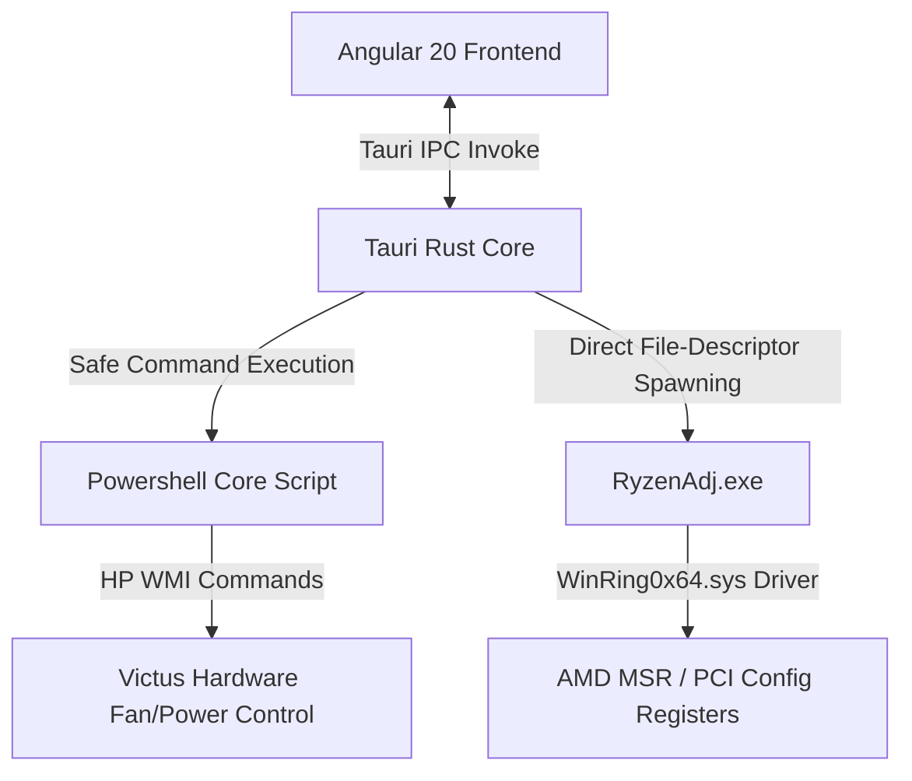

# VictusDeck System Architecture Documentation

Welcome to the **VictusDeck** architecture documentation. This document outlines the system components, data flows, and design decisions of the hardware control suite.

---

## 1. System Architecture Overview

VictusDeck is a hybrid desktop application designed to control hardware settings (specifically fan speeds and power limits) on HP Victus series laptops. It is built using the following technologies:
- **Frontend**: Angular 20 (Standalone Component structure)
- **Desktop Runtime**: Tauri v2
- **Backend / System Interface**: Rust (with a safe execution layer interfacing with PowerShell scripts and low-level system binaries)

---

## 2. Key Subsystems & Mechanisms

### 2.1 Fan Control Mode
- **Powershell Script Path**: `C:\Program Files\fanControl\omen-hub-but-better\OmenHwCtl.ps1`
- **Execution Argument**: `-SetFanLevel`
- **Format**: `left_fan:right_fan` (e.g. `30:30` represents both fans set to level 30).
- **Manual Control Switch**: A toggle control enables manual override of the fan cycle.
  - **Manual Off**: Disables input sliders and sends `0:0` (System Auto / Fan Off) to reset native thermal curves.
  - **Manual On**: Enables custom range slider to apply exact duty cycle inputs between levels `19` and `39`.
- **Level & RPM Calibration**:
  - **Minimum Bounds**: Level `8` maps to `800 RPM` (leftmost position, zero-padded as `08:08` inside manual control command arguments).
  - **Maximum Bounds**: Level `39` maps to `5700 RPM` (maximum physical duty cycle).
  - **Range Calibrations**:
    - **Idle State (Level 8)**: Returns exactly `800 RPM` (formatted as `08:08`).
    - **Intermediate Step (Level 9)**: Returns `1200 RPM`.
    - **Lower Range (Levels 10 to 19)**: Starts at `1600 RPM` and increments linearly by `100 RPM` per step up to Level `19` (`2500 RPM`). Formula: `RPM = 1600 + (level - 10) * 100`.
    - **Transition Jump 1 (Level 19 to 20)**: Jumps from `2500 RPM` (level 19) to `3200 RPM` (level 20), representing a sudden `700 RPM` jump.
    - **Middle Range (Levels 20 to 29)**: Starts at `3200 RPM` and increments linearly by `100 RPM` per step up to Level `28` (`4000 RPM`). Level `29` maps to `4200 RPM`. Formula: `RPM = 3200 + (level - 20) * 100`.
    - **Transition Jump 2 (Level 29 to 30)**: Jumps from `4200 RPM` (level 29) to `4800 RPM` (level 30), representing a sudden `600 RPM` jump.
    - **Upper Range (Levels 30 to 39)**: Starts at `4800 RPM` and increments linearly by `100 RPM` per step up to Level `39` (`5700 RPM`). Formula: `RPM = 4800 + (level - 30) * 100`.
- **System Profile Mappings (Tauri Backend)**:
  - `silent` / `battery` => level `19:19` (`2500 RPM`)
  - `balanced` / `medium` / `laptop` / `table` => level `30:30` (`4800 RPM`)
  - `high` / `turbo` / `performance` => level `34:34` (`5200 RPM`)
  - `max` / `extreme` => level `39:39` (`5700 RPM`)

### 2.2 System Profiles
Profiles are predefined system configurations designed for specific power and acoustic profiles:
- **battery**: 12W power limit, Silent fan speed (`19:19`).
- **laptop**: 25W power limit, Balanced fan speed (`30:30`).
- **table**: 35W power limit, Medium fan speed (`30:30`).
- **performance**: 45W power limit, High fan speed (`34:34` / turbo).
- **extreme**: 55W power limit, Max fan speed (`34:34` / turbo).

---

## 3. RyzenAdj CPU Control Subsystem

- **Execution Binary**: `src-tauri/resources/ryzenadj-win64/ryzenadj.exe` (with `./bin/ryzenadj.exe` and system PATH as fallbacks).
- **Execution Mode**: Non-blocking `async fn` commands executed on Tauri’s Tokio worker thread pool to prevent blocking the UI event loop.
- **Privileged Access Handling**: Since RyzenAdj modifies low-level hardware control tables, it requires elevated Administrator/root permissions. If lacking privileges, the backend command catches execution and permission failures (`os_access` errors) gracefully and passes structured error packets back to the frontend instead of causing a panic or application crash.
- **Real-Time Polling**: The frontend triggers a background scheduler to poll CPU diagnostics (`get_cpu_status`) every 2 seconds, parsing human-readable table outputs dynamically into active values (`STAPM Limit`, `Fast PPT Limit`, `Slow PPT Limit`, `Temp Throttle Limit`).
- **Standard Presets**:
  - `Silent` $\rightarrow$ 15W TDP / 70°C throttle
  - `Balanced` $\rightarrow$ 35W TDP / 80°C throttle
  - `Performance` $\rightarrow$ 55W TDP / 90°C throttle
  - `Custom` $\rightarrow$ 8W to 55W customized slider
