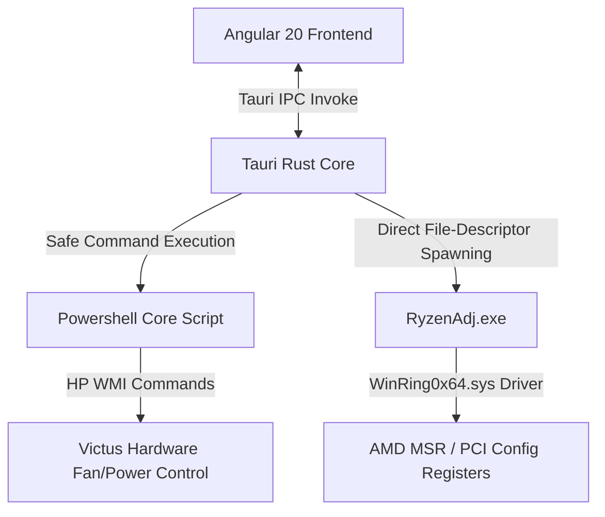

# NiyanTraK System Architecture Documentation

Welcome to the **NiyanTraK** architecture documentation. This document outlines the system components, data flows, and design decisions of the hardware control suite.

---

## 1. System Architecture Overview

NiyanTraK is a hybrid desktop application designed to control hardware settings (specifically fan speeds and power limits) on HP Victus series laptops. It is built using the following technologies:
- **Frontend**: Angular 20 (Standalone Component structure)
- **Desktop Runtime**: Tauri v2
- **Backend / System Interface**: Rust (with a safe execution layer interfacing with PowerShell scripts and low-level system binaries)



---

## 2. Key Subsystems & Mechanisms

### 2.1 Fan Control Mode
- **Powershell Script Path**: `C:\Program Files\fanControl\omen-hub-but-better\OmenHwCtl.ps1`
- **Execution Argument**: `-SetFanLevel`
- **Format**: `left_fan:right_fan` (e.g. `30:30` represents both fans set to level 30).
- **Manual Control Switch**: A toggle control enables manual override of the fan cycle.
  - **Manual Off**: Disables input sliders and sends `0:0` (System Auto / Fan Off) to reset native thermal curves.
  - **Manual On**: Enables custom range slider to apply exact duty cycle inputs between levels `19` and `39`.
- **Level & RPM Calibration**:
  - **Minimum Bounds**: Level `8` maps to `800 RPM` (leftmost position, zero-padded as `08:08` inside manual control command arguments).
  - **Maximum Bounds**: Level `39` maps to `5700 RPM` (maximum physical duty cycle).
  - **Range Calibrations**:
    - **Idle State (Level 8)**: Returns exactly `800 RPM` (formatted as `08:08`).
    - **Intermediate Step (Level 9)**: Returns `1200 RPM`.
    - **Lower Range (Levels 10 to 19)**: Starts at `1600 RPM` and increments linearly by `100 RPM` per step up to Level `19` (`2500 RPM`). Formula: `RPM = 1600 + (level - 10) * 100`.
    - **Transition Jump 1 (Level 19 to 20)**: Jumps from `2500 RPM` (level 19) to `3200 RPM` (level 20), representing a sudden `700 RPM` jump.
    - **Middle Range (Levels 20 to 29)**: Starts at `3200 RPM` and increments linearly by `100 RPM` per step up to Level `28` (`4000 RPM`). Level `29` maps to `4200 RPM`. Formula: `RPM = 3200 + (level - 20) * 100`.
    - **Transition Jump 2 (Level 29 to 30)**: Jumps from `4200 RPM` (level 29) to `4800 RPM` (level 30), representing a sudden `600 RPM` jump.
    - **Upper Range (Levels 30 to 39)**: Starts at `4800 RPM` and increments linearly by `100 RPM` per step up to Level `39` (`5700 RPM`). Formula: `RPM = 4800 + (level - 30) * 100`.
- **System Profile Mappings (Tauri Backend)**:
  - `silent` / `battery` => level `19:19` (`2500 RPM`)
  - `balanced` / `bed` / `medium` / `laptop` / `table` => level `30:30` (`4800 RPM`)
  - `high` / `turbo` / `performance` => level `34:34` (`5200 RPM`)
  - `max` / `extreme` => level `39:39` (`5700 RPM`)

### 2.2 System Profiles
Profiles are predefined system configurations designed for specific power and acoustic profiles:
- **battery**: 12W power limit, Silent fan speed (`19:19`).
- **laptop**: 25W power limit, Balanced fan speed (`30:30`).
- **table**: 35W power limit, Medium fan speed (`30:30`).
- **performance**: 45W power limit, High fan speed (`34:34` / turbo).
- **extreme**: 55W power limit, Max fan speed (`34:34` / turbo).

---

## 3. RyzenAdj CPU Control Subsystem

- **Execution Binary**: `src-tauri/resources/ryzenadj-win64/ryzenadj.exe` (with `./bin/ryzenadj.exe` and system PATH as fallbacks).
- **Execution Mode**: Non-blocking `async fn` commands executed on Tauri’s Tokio worker thread pool to prevent blocking the UI event loop.
- **Privileged Access Handling**: Since RyzenAdj modifies low-level hardware control tables, it requires elevated Administrator/root permissions. If lacking privileges, the backend command catches execution and permission failures (`os_access` errors) gracefully and passes structured error packets back to the frontend instead of causing a panic or application crash.
- **Real-Time Polling**: The frontend triggers a background scheduler to poll CPU diagnostics (`get_cpu_status`) every 2 seconds, parsing human-readable table outputs dynamically into active values (`STAPM Limit`, `Fast PPT Limit`, `Slow PPT Limit`, `Temp Throttle Limit`).
- **Telemetry Expansion**:
  - **Sustained & Burst Power (PPT)**: Merges Fast PPT and Slow PPT wattage telemetry. Displays real-time consumption values alongside target limits, and reads out active Slow Time constant values (Slow Time cooling constants).
  - **Sustained Power (STAPM)**: Renders live sustained power usage alongside configured BIOS limits and STAPM Time constant cooling boundaries.
  - **Sensors & Thermals**: Monitors and plots CPU Core Temperature (`THM VALUE CORE`), APU Skin Temperature (`STT VALUE APU`), and dGPU Skin Temperature (`STT VALUE dGPU`), together with their safety throttle limits.
  - **Peak Tracking**: Tracks actual real-time peak values of active wattage consumption and core temperatures dynamically inside Angular.
- **Dynamic Safety Temperature Targets**:
  - Enables user-customizable thermal throttling boundaries ranging from `50°C` to `95°C` setting via the `--tctl-temp` argument.
- **Standard Presets**:
  - `Silent` $\rightarrow$ 15W TDP / 70°C throttle
  - `Bed Mode` $\rightarrow$ 35W TDP / 80°C throttle
  - `Performance` $\rightarrow$ 55W TDP / 90°C throttle
  - `Custom` $\rightarrow$ 8W to 55W customized slider and custom safety thermal limit slider

### 3.3 CPU Stress Test Subsystem
- **Execution Module**: `src-tauri/src/core/stress.rs`
- **Execution Mode**: Spawns multithreaded OS worker threads matching the system's logical core capacity (via `std::thread::available_parallelism()`).
- **Core Workload**: Executes synthetic math loops (`sqrt().sin().cos()`) utilizing both FPU and ALU execution pipelines to guarantee full, 100% CPU thread saturation.
- **Yielding Safety Design**: To prevent kernel scheduling blockages and interface freezes, each thread cooperatively invokes `thread::yield_now()`. This ensures the Tauri main thread and Windows window manager maintain high responsiveness while maximum thermal/wattage load is placed on the hardware registers.
- **Safety Termination**: If active, the stress test is automatically stopped upon the destruction or shutdown of the Tauri frontend application window, preventing background processor drain.

### 3.4 Persistent Custom Profile Presets
- **State Persistence**: Presets are loaded from and saved to a physical JSON file `custom_presets.json` in the workspace root instead of browser `localStorage`.
- **Tauri IPC Endpoints**: Invokes `load_custom_presets` and `save_custom_presets` Tauri commands for secure disk read/write access.
- **Preset Object Layout**:
  ```json
  [
    {
      "name": "custom_1716301234567",
      "powerLimit": 45,
      "fan": "manual",
      "fanLevel": 34,
      "fanLabel": "5200 RPM",
      "label": "Gaming Balanced",
      "isCustom": true,
      "tempLimit": 85
    }
  ]
  ```
- **In-Place Overwrites**: Entering an existing preset label updates its parameters in place rather than appending duplicate profiles.

### 3.5 Dynamic Island Header Toast Center
- **Capsule Shell Layout**: Replaces standard bottom-fixed toasts with a premium, Apple-like "Dynamic Island" morphing capsule in the horizontal center of the Top Bar.
- **Idle State**: Displays the active performance profile (e.g. `⚡ PERFORMANCE` or `⚡ BED MODE`) with a subtle glowing border.
- **Morphing State**: Upon alert emission, spring-expands smoothly using CSS scale and size transitions, rendering success/error icons and alert messages. Reverts automatically back to the idle active profile capsule after 4.5 seconds.

---

## 4. Build System and Styling Configuration
- **Tailwind CSS version**: v4
- **PostCSS integration**: Configured through `postcss.config.json` (and `postcss.config.js`) in the project root utilizing the new `@tailwindcss/postcss` builder plugin package for v4.
- **Global Stylesheet**: `@import url(...)` for Google Fonts comes first, then `@import "tailwindcss"` — order is required by CSS spec.

## 5. UI Architecture — Standalone Component Decomposition

The user interface has been decomposed from a single monolithic file into a decoupled, modular hierarchy consisting of **10 standalone Angular components** nested under `src/app/components/`. 

The parent `AppComponent` remains the central state orchestrator, managing background polling loops, RyzenService integrations, and Tauri IPC command dispatches. Data is passed down to child elements via `@Input()`, and user interactions are piped back up to the orchestrator via `@Output() / EventEmitter` bindings.

### Component Architecture Map

*   **NavRailComponent (`app-nav-rail`)**: Left-anchored sidebar navigation rail docked underneath the horizontal Top Bar, hosting buttons for Quick Control and Stress Test pages.
*   **TopBarComponent (`app-top-bar`)**: Upper-anchored header spanning the entire width horizontally, displaying the custom brand logo in the top-left corner and the dynamic CPU state status pill on the right.
*   **StressBannerComponent (`app-stress-banner`)**: Floating overlay displaying progress bar and remaining duration capsule while stress workloads are running.
*   **MonitorStripComponent (`app-monitor-strip`)**: Real-time telemetry cards (FAST PPT, SLOW PPT, TEMP, STAPM) displaying peak values and hosting the floating peak reset action button.
*   **ProfilesDrawerComponent (`app-profiles-drawer`)**: Horizontal tray hosting preset performance configuration cards (Battery Saver, Bed Mode, Table Mode, Performance, Extreme, + Custom).
*   **BezelStripsComponent (`app-bezel-strips`)**: Floating bezel tab ribbons nested on the right edge of the screen, allowing users to fold/unfold the Profiles drawer and trigger stress workloads on any view.
*   **FanControlComponent (`app-fan-control`)**: Cooling sub-system card hosting the manual fan speed override toggle, linear level slider, dynamic RPM readout, and Apply controls.
*   **CPUPowerPanelComponent (`app-cpu-power-panel`)**: Power limit card hosting active preset mode badge, exact watt custom TDP slider, and Apply controls.
*   **StressPanelComponent (`app-stress-panel`)**: FPU workload configuration view hosting segmented presets for duration and intensity, along with a 16-thread Core Burn simulator grid.
*   **FooterStripComponent (`app-footer-strip`)**: Bottom-anchored credit and version notice.

### Scoped Style Encapsulation & Host Layouts
1. **Style Isolation**: All CSS rules are encapsulated locally within each child component's `@Component.styles` attribute block using pure, vanilla CSS to maintain 100% design fidelity.
2. **Width Split (50/50 Layout)**: Custom elements `app-fan-control` and `app-cpu-power-panel` are styled with host flex rules (`flex: 1; display: flex; flex-direction: column;`) to preserve perfect visual column sizing.
3. **Margins & Bezel Peeking**: Layout paddings and absolute overlay coordinate maps leverage the standard `59px` right margin to maintain symmetrical alignment alongside the right edge bezel tabs.
4. **Curved Inner Frame Dock**: The main content wrapper `.main-frame-body` features a `border-top: 1px solid #222`, `border-left: 1px solid #222`, and `border-top-left-radius: 14px`. This creates a premium, smooth rounded border intersection where the top bar and left nav-rail meet, blending the outer `#0d0d0d` visual frame into the inner `#111111` active dashboard workspace.

### Visual Design Tokens (enforced)
| Token            | Value     | Usage                          |
|------------------|-----------|--------------------------------|
| Window bg        | `#0f0f0f` | `app-shell` background         |
| Topbar / Rail bg | `#0d0d0d` | `topbar`, `nav-rail`, `monitor-strip` |
| Content area bg  | `#111111` | `main-body`                    |
| Card bg          | `#171717` | `.card`, `.fan-card`           |
| Interactive bg   | `#1e1e1e` | Inputs, seg controls           |
| Separator border | `#222222` | All section dividers           |
| Card border      | `#242424` | Card outlines                  |
| Accent blue      | `#3b82f6` | Active states, toggles, sliders|
| Accent green     | `#22c55e` | Bar fill < 70% of limit        |
| Accent amber     | `#f59e0b` | Bar fill 70–90% of limit       |
| Accent red       | `#ef4444` | Bar fill > 90%, stress state   |
