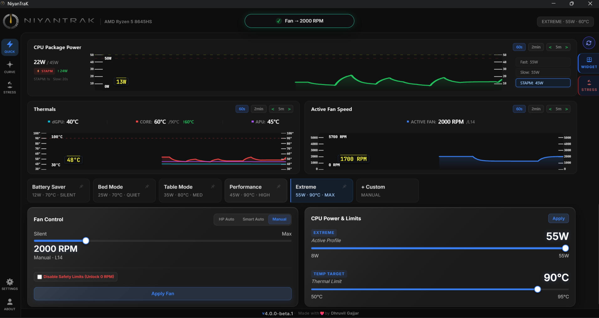
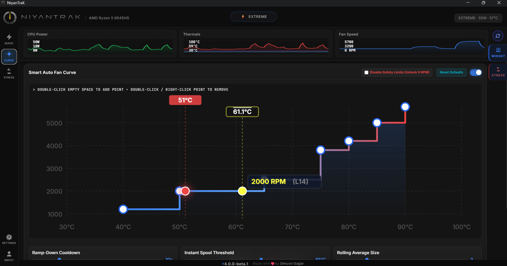

# NiyanTraK (NTK)

> [!WARNING]
> **SAFETY & LIABILITY DISCLAIMER:** This utility is capable of overriding low-level CPU power borders and Embedded Controller fan curves. Setting values incorrectly can cause thermal throttling or instability. By using this software, you assume all risks. The developer is NOT responsible for any hardware damage or data loss.

NiyanTraK is a premium, open-source Windows hardware utility designed to customize CPU power limits and fan speeds on HP Victus, Omen, and Pavilion Gaming series laptops.

> [!IMPORTANT]
> **ADMINISTRATOR ELEVATION REQUIRED:** Because this tool writes low-level registers via `RyzenAdj` and handles direct Embedded Controller (EC) communication through a persistent PowerShell daemon (`OmenHwCtl.ps1`), **you must run NiyanTraK as Administrator** to allow hardware queries and overrides to function.

---

## Preview & Screenshots

<div align="center">
  
  
</div>

---

## Project Status: Beta Rollout
NiyanTraK is currently in an active **Beta** stage. While it has been extensively tested, low-level hardware communication can behave differently across BIOS revisions. Please monitor your system telemetry when applying custom settings.

### Tested & Verified Hardware
The utility has been successfully tested on the following laptop models:
- **HP Victus 15 / 16** (AMD Ryzen 5 5600H)
- **HP Pavilion Gaming** (AMD Ryzen 5 5600H)
- **HP Victus 15 / 16** (AMD Ryzen 5 8645HS)

*Note: While designed for HP laptops, other systems can override safety block limits at their own risk using the "Disable Safety Limits" toggle in the interface.*

---

## Telemetry & Debug Logs

All diagnostic logs, thermal decisions, and RyzenAdj telemetry exports are saved in your user profile's standard documents folder:

* **Log Export Directory:** `%USERPROFILE%\Documents\NTK\` (`C:\Users\<YourUsername>\Documents\NTK\`)

### Log Types Generated
- **Manual Diagnostics:** Created when clicking "Export Logs" on the Fan Curve screen.
  - File: `debug_logs_[timestamp].txt`
- **Scheduled Auto-Export:** Created automatically if auto-export is enabled in settings.
  - File: `Scheduled/scheduled_logs_[timestamp].txt`
- **Shutdown Logs:** Written automatically upon system shutdown/app close to record runtime boundaries.
  - File: `shutdown_debug_logs_[timestamp].txt`


---

## Key Features

- **Ryzen CPU Tuning**: Refine RyzenAdj CPU power thresholds (TDP limits, Temperature limits) dynamically.
- **Smart Auto Step-Curves**: Customize stepped smart fan curves operating on discrete temperature lookup coordinates for optimal acoustics.
- **Dual-Sensor Safety Safeguards**: Automatically forces fan speeds to Level 39 (max speed) if the CPU reaches $\ge$ 95°C or the skin temperature reaches $\ge$ 56°C. Sets speeds to at least Level 30 if CPU reaches $\ge$ 90°C or skin temperature reaches $\ge$ 52°C.
- **Persistent PowerShell Daemon**: Low-latency Embedded Controller writes bypass startup overheads (<20ms delay).
- **First-Boot Verification**: Automatic Windows Registry queries check BIOS compatibility.

---

## Getting Started

### Prerequisites

To compile NiyanTraK from source, make sure you have the following installed:
1. **Node.js** (v18+)
2. **Rust & Cargo** (v1.75+)
3. **C++ Build Tools** (via Visual Studio Installer)

### Installation & Build

1. Clone the repository:
   ```bash
   git clone https://github.com/dhr-dev/niyantrak.git
   cd niyantrak
   ```

2. Install frontend dependencies:
   ```bash
   npm install
   ```

3. Run in Development Mode:
   To simplify setup and handle the required Administrator elevation automatically, we provide a bootstrap script:
   ```bash
   npm run dev-up
   ```
   *This executes `dev-up.ps1` under the hood, which will prompt a Windows User Account Control (UAC) dialog for elevation and launch the elevated development server.*

4. Build Production Bundle Installer:
   ```bash
   npm run tauri build
   ```
   The compiled `.msi` and `.exe` installers will be generated under `src-tauri/target/release/bundle/`.

---

## License

This project is licensed under the [MIT License](LICENSE) - see the LICENSE file for details.

---

## Credits & Acknowledgements

NiyanTraK relies on and is inspired by the following open-source hardware projects:

- **[RyzenAdj](https://github.com/FlyGoat/RyzenAdj)** (`https://github.com/FlyGoat/RyzenAdj`): Developed by FlyGoat and contributors (licensed under GPL-3.0). It provides the underlying raw AMD APU power boundary registers control.
- **[OmenHwCtl](https://github.com/GeographicCone/OmenHwCtl)** (`https://github.com/GeographicCone/OmenHwCtl`): Developed by GeographicCone and contributors (licensed under GPL-3.0). It provides the underlying HP BIOS WMI Embedded Controller commands (`OmenHwCtl.ps1`) for fan control operations.
- **[fanControl](https://github.com/Giacomix02/fanControl)** (`https://github.com/Giacomix02/fanControl`): Developed by Giacomix02 (licensed under GPL-3.0). This project served as the initial reference and introduced us to utilizing OmenHwCtl Embedded Controller command mappings.

Many thanks to the developers of these projects for their contribution to the PC hardware customization community!
